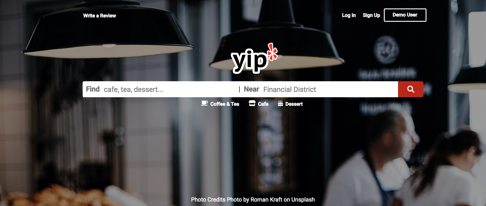
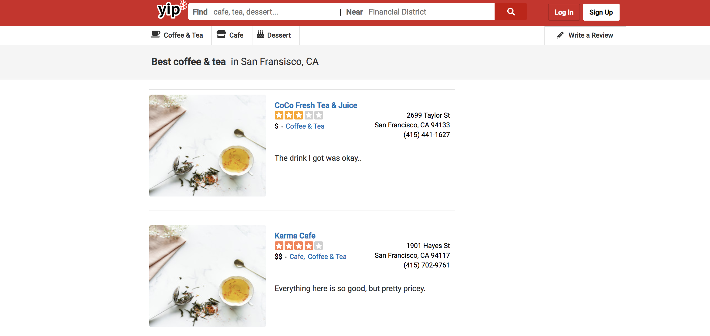
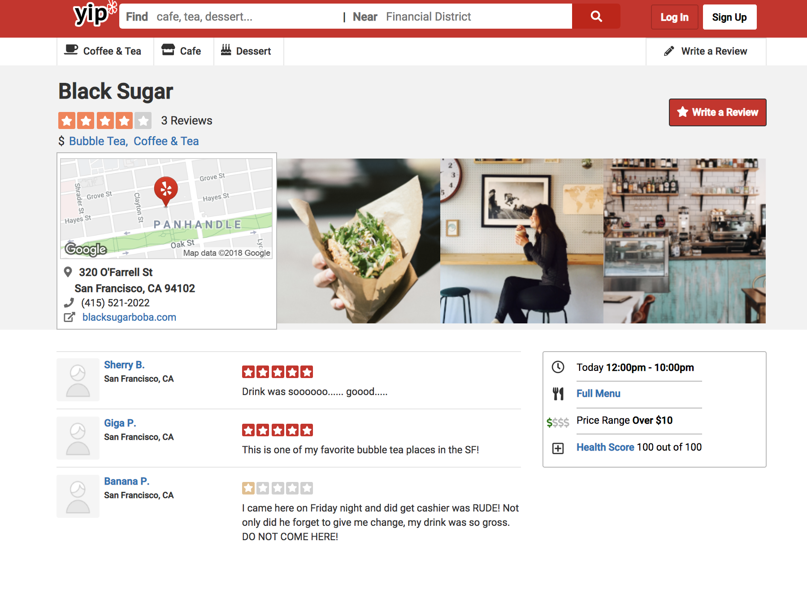

# Yip

* Yip is a Yelp clone, you can search restaurants by name and categories and write reviews. Click here for the [live](https://yip2018.herokuapp.com/#/) demo.



## Technologies
  * JQuery
  * Postgres SQL
  * Ruby on Rails
  * React
  * Javascript

## Features:

  * Search by name and category
      * Challenge: Passing information to the index page with all the businesses
      * Solution: Created a query string that would be parsed on the business index page and saved in the local state

      ``` javascript
        constructor(props) {
          super(props);
          this.state = {
            name: "",
            query: ""
        }
        this.businessCategories = this.businessCategories.bind(this);
        this.searchBusinesses = this.searchBusinesses.bind(this);
        this.redirectShow = this.redirectShow.bind(this);
      }
      searchBusinesses(category){
        return (e) => {
          e.preventDefault();
          this.setState({name: category}, () => {
            this.props.fetchBusinesses(this.state)
            .then(
              () => this.props.history.push({ pathname:'/businesses', search: `?name=${category}`})
            )
          });
        }
      }
      ```

  * Reviews on the business show page
    * Challenge: Passing authored users to the business show page
    * Solution: The payload from the backend includes: businesses, business's reviews, and authored reviews
         ``` ruby
        json.businesses do
          @businesses.each do |business|
            json.set! business.id do
              json.avg_rating business.reviews.average(:rating).round(1)
              json.num_reviews business.reviews.count
              json.extract! business, :id, :name, :address, :phone, :price
              json.categories business.categories.map { |category| category.title }
            end
          end
        end

        json.reviews do
          @businesses.each do |business|
            json.set! business.reviews.first.business_id do
              json.extract! business.reviews.first, :id, :description, :author_id, :business_id, :rating
            end
          end
        end
      ```


## Deployment instructions
   *  npm run test
   *  rails s

## Future Features
  *  Edit Post and a Route for Write a Review button
  *  Google Maps and pull from Google maps
  *  Active Storage all the images
